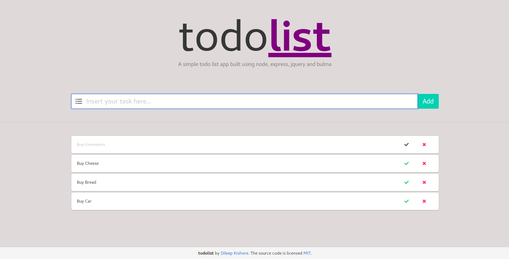

# todolist

An application made using nodejs, express, mongodb, jQuery and bulma.



## Structure

1. The TODO model in mongodb has three properties: name (required), completed (default: false) and date created (default: Date.now)
2. `Express` is used to create the following apis:
    * `GET` @ '/api/todos/' - Retrieves all todos in the database
    * `POST` @ '/api/todos/' - Creates a new todo in the database
    * `GET` @ '/api/todos/:todoId' - Retrieves a particular todo by id
    * `DELETE` @ '/api/todos/:todoId' - Deletes a particular todo by id
    * `PUT` @ '/api/todos/:todoId' - Updates a particular todo by id
3. The `jQuery` view model utilizes the above apis to manage todos in the database

## Install

1. Install [npm](https://docs.npmjs.com/getting-started/installing-node)
2. Install [mongodb](https://www.mongodb.com/download-center?jmp=nav#community)
3. Install node packages
```sh
npm install
```
4. Install nodemon [Optional]
```sh
npm install -g nodemon
```

## Run

First start the `mongodb` server
```sh
./mongod
```

- Run using `node`
```sh
node index.js
```

- Run using `nodemon` (automatic server restarts - useful for development)
```sh
nodemon index.js
```
